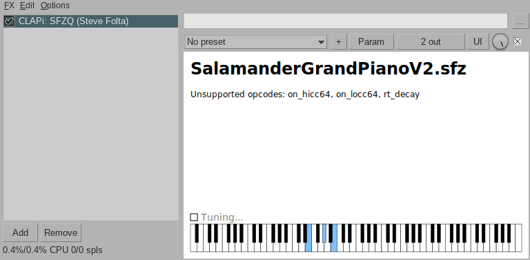

SFZQ
=====

SFZQ is a CLAP plugin for Linux that plays sample-based instruments in SFZ and SF2 formats.

### Dependencies

Requires Cairo.

### Supported SFZ Opcodes

amp\_veltrack, ampeg\_delay, ampeg\_start, ampeg\_attack, ampeg\_hold, ampeg\_decay,
ampeg\_sustain, ampeg\_release, ampeg\_vel2delay, ampeg\_vel2start,
ampeg\_vel2attack, ampeg\_vel2hold, ampeg\_vel2decay, ampeg\_vel2sustain,
ampeg\_vel2release, bend\_up, bend\_down, default\_path, end, group, key, lokey,
hikey, loop\_start, loop\_end, loop\_mode, lorand, hirand, lovel, hival, off\_by,
offset, pan, pitch\_keycenter, pitch\_keytrack, sample, transpose, trigger,
tune, volume.

### Supported SFZ Headers

\<control\>, \<global\>, \<group\>, \<region\>.

### Settings.

You can create a settings file at "~/.config/sfzq/settings" (or "$XDG\_CONFIG\_HOME/sfzq/settings" if that's your jam), which can include these settings:

<dl>
<dt> samples-directory = "<i>path</i>" </dt>
<dd>
Sets a default path where you keep your samples.  When the file chooser comes
up, it will start in this directory.
</dd>
<dt> num-voices = <i>number</i> </dt>
<dd>
Sets the maximum number of voices that can be sounded at once.
</dd>
<dt> show-voices-used = <i>boolean</i> </dt>
<dd>
Controls whether current number of voices used is displayed in the UI.   Set to
<code>true</code> or <code>false</code>.
</dd>
<dt> tunings-directory = "<i>path</i>" </dt>
<dd>
Sets a default path where you keep your tunings.  When the file chooser comes
up to choose a tuning, it will start in this directory.
</dd>
</dl>

### Tunings

Alternate ("microtonal") tunings are supported in the Scala (".scl") file format (thanks to the 
[Surge Tuning Library](https://surge-synth-team.org/tuning-library/)).

# For Programmers

SFZQ is built on three independent components, each of which could be extracted
and used in other projects:

SFZPlayer: reads and plays SFZ and SF2 files  
CLAPFramework: a simple framework for CLAP plugins  
CairoWidgets: a widget library using Cairo to draw

